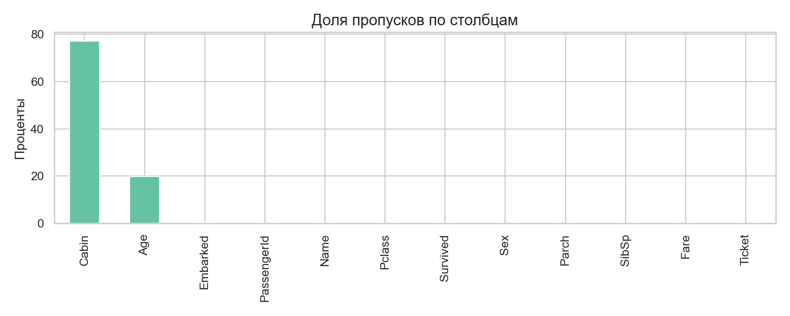
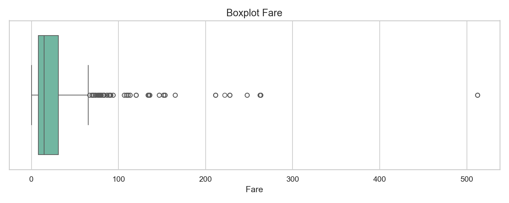
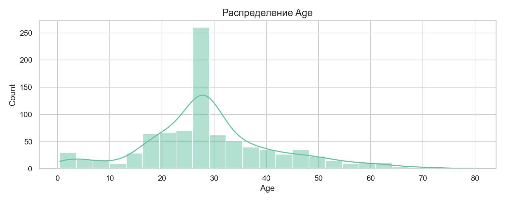
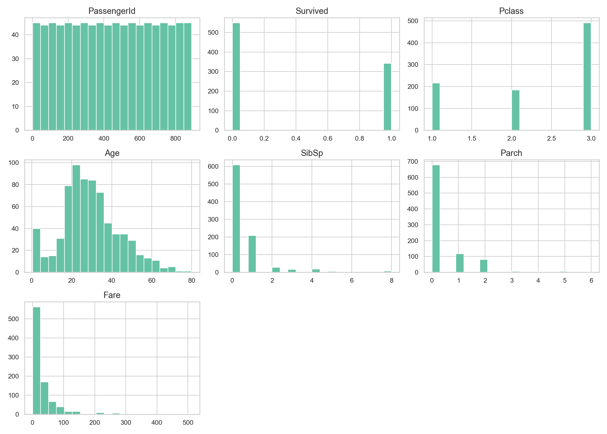

# Отчет по LR6

## Введение
В работе выполнена очистка и трансформация данных Titanic с помощью pandas.  
Основная цель это привести данные к виду, удобному для анализа и построения признаков.

## Цель работы
Освоить методы предобработки данных  
Обработать пропуски  
Преобразовать типы и признаки  
Выявить и обработать выбросы  
Выполнить агрегацию и оценить качество очистки

## Описание набора данных
Использован датасет Titanic из Kaggle.  
Размер исходного набора 891 строка и 12 столбцов.

Ключевые признаки:
- `Survived`
- `Pclass`
- `Sex`
- `Age`
- `Fare`
- `Cabin`
- `Embarked`

## Первичный анализ
В ноутбуке выполнены:
- вывод первых 10 строк
- проверка типов столбцов
- анализ пропусков
- описательная статистика
- гистограммы числовых признаков

### Статистика датафрейма
- До очистки пропуски были в `Age`, `Cabin`, `Embarked`
- Средний возраст `29.699`
- Медианный возраст `28.0`

### Визуализация пропусков
Использована таблица с числом и долей пропусков по каждому столбцу.  
Наибольшая доля пропусков была в `Cabin`.

Сохраненный график:
- `plots/01_missing_values.png`

## Обработка пропусков
### Методы заполнения
- `Age` заполнен медианой `28.0`
- Создан признак `Age_group`
- `Embarked` заполнен модой `S`
- Для `Cabin` создан признак `CabinDeck` по первой букве, для пустых значений использован `Unknown`

### Результаты обработки
- Общая доля закрытых пропусков `20.67%`
- Пропуски в `Age` и `Embarked` устранены полностью
- Пропуски в `Cabin` сохранены в исходном столбце, но добавлен рабочий признак `CabinDeck`

## Трансформация данных
### Созданные признаки
- `Age_group`
- `Title`
- `FamilySize`
- `IsAlone`
- `Fare_winsor`
- `Age_capped`
- `CabinDeck`

### Преобразования типов
- `Pclass` преобразован в категории `F`, `S`, `T`
- `Sex` преобразован в формат `0/1`
- `FamilySize` рассчитан как `SibSp + Parch + 1`
- `IsAlone` задан как `1` при `FamilySize == 1`, иначе `0`

Количество уникальных значений:
- `Pclass` `3`
- `Embarked` `3`
- `CabinDeck` `9`
- `Title` `17`
- `Age_group` `5`

## Обработка выбросов
### Выявленные выбросы
Для `Fare` применен IQR метод:
- Нижняя граница `-26.724`
- Верхняя граница `65.634`
- Число выбросов `116`

### Методы обработки
- Для `Fare` применена winsorization с ограничениями по 5 процентам по краям
- Для `Age` экстремумы ограничены 95 перцентилем
- Значение `Age p95` равно `54.0`

Сохраненные графики:
- `plots/03_fare_boxplot.png`
- `plots/04_age_distribution.png`

## Агрегация и анализ
### Сводные статистики
Средняя выживаемость по классам:
- `F` `0.630`
- `S` `0.473`
- `T` `0.242`

Медианный возраст по портам:
- `C` `28.0`
- `Q` `28.0`
- `S` `28.0`

Распределение `IsAlone`:
- `1` `0.603`
- `0` `0.397`

### Корреляции новых признаков
По матрице корреляции:
- `Sex` и `Survived` имеют выраженную отрицательную связь `-0.543`
- `Fare_winsor` и `Survived` имеют положительную связь `0.312`
- `IsAlone` и `Survived` имеют отрицательную связь `-0.203`

## Сохранение данных
Очищенный датасет сохранен в файл `data/titanic_cleaned.csv`.

## Список графиков
- `plots/01_missing_values.png`
- `plots/02_numeric_histograms.png`
- `plots/03_fare_boxplot.png`
- `plots/04_age_distribution.png`

## Заключение
Все базовые пункты задания выполнены  
Пропуски обработаны и дополнены новыми признаками  
Типы данных приведены к удобному виду  
Выбросы выявлены и сглажены  
Получены агрегированные показатели и метрики качества очистки  
Датасет подготовлен для дальнейшего анализа и ML задач
